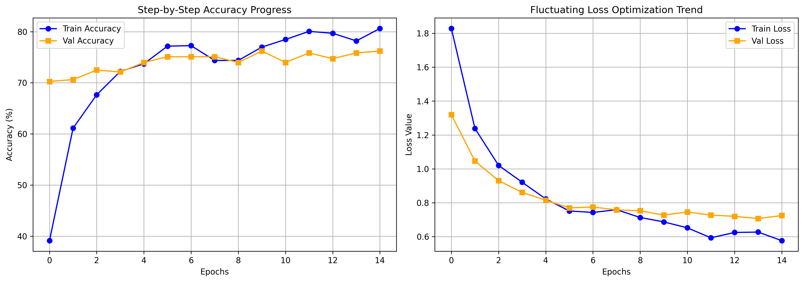

# 🌿 AI for Biodiversity: Fine-Grained Monkey Species Classification
## 🚀 Neural Networks & Computer Vision (NNCV) Project Showcase

[](https://www.python.org/)
[](https://pytorch.org/)
[](https://opensource.org/licenses/MIT)

---

## 📌 1. Project Vision & Business Imperative

Manual wildlife tracking across vast, remote conservation sanctuaries is an operational bottleneck for global forestry and preservation efforts. Traditional camera traps capture thousands of motion-activated images daily, creating a massive "data deluge" that requires weeks of manual human sorting. 

This repository implements a production-grade **Discriminative AI System** designed to solve this crisis. By modeling the conditional probability distribution $P(Y \mid X)$—predicting the target monkey species $Y$ given a raw visual pixel tensor $X$—this pipeline automates wildlife monitoring at scale.

### 💡 High-Value Conservation Insights:
* **Real-Time Medical Triage & Anti-Poaching:** Flags immediate presence or changes in behavior for highly vulnerable/endangered primates like the *Bald Uakari*, allowing for localized field interventions.
* **Ecological Density Mapping:** Aggregates multi-station telemetry into dynamic species heatmaps, mapping migration corridors and guiding infrastructure protection policies.
* **Biodiversity Index Monitoring:** Provides continuous automated population counts, acting as an early warning metric for environmental decay, resource depletion, or hidden disease outbreaks.

---

## 📊 2. Dataset Specifications

The system utilizes a structured primate dataset modeled after native cladogram indexes, serving as a challenging benchmark due to extreme **intra-class variance** (poses, deep forest lighting, heavy occlusion) and intense **inter-class similarity** across closely related primate genera.

* **Total Scale:** ~1,342 high-resolution color images distributed across 10 classes (~130 samples per class).
* **Target Schema:**
  * `n0`: Mantled Howler (`alouatta_palliata`)
  * `n1`: Patas Monkey (`erythrocebus_patas`)
  * `n2`: Bald Uakari (`cacajao_calvus`)
  * `n3`: Japanese Macaque (`macaca_fuscata`)
  * `n4`: Pygmy Marmoset (`cebuella_pygmea`)
  * `n5`: White-Headed Capuchin (`cebus_capucinus`)
  * `n6`: Silvery Marmoset (`mico_argentatus`)
  * `n7`: Common Squirrel Monkey (`saimiri_sciureus`)
  * `n8`: Black-Headed Night Monkey (`aotus_nigriceps`)
  * `n9`: Nilgiri Langur (`trachypithecus_johnii`)

### 🛠️ Data Integrity Engineering
Raw text targets were programmatically converted via an exact lookup index into clean numerical tensors ($0 \dots 9$) inside a custom PyTorch dataset engine to prevent downstream cross-entropy runtime faults. To handle varying lighting environments and off-angle field captures, data transformations include horizontal reflections, spatial resizing, and ImageNet distribution channel normalization.

---

## 🧠 3. System Architecture & Transfer Learning

Training deep computer vision frameworks from scratch with sparse data assets risks massive overfitting or weight divergence. This project leverages an advanced **Transfer Learning** architecture to solve this limitation.

### Base Backbone: EfficientNet-B0
We utilize an **EfficientNet-B0** base network pre-trained on ImageNet. EfficientNet's structural optimization balances network depth, width, and resolution scaling:
* **Feature Extraction (Frozen):** We explicitly lock the gradient calculation paths for the entire feature extractor blocks (`param.requires_grad = False`). This freezes the universal visual primitives—mathematically behaving like localized **Gabor Filters** that pull out basic geometric textures, edges, and fur patterns without catastrophic forgetting.
* **Computational Footprint Optimization:** By freezing the backbone, we drastically reduce memory usage during backpropagation, enabling lightweight edge execution loops.

### Custom Classification Head Design
The standard 1,000-class output head was stripped and replaced with a robust, multi-layered discriminative bottleneck blocks configured as follows:

$$\text{Global Average Pooling (2D)} \longrightarrow \text{Dropout 1 (p=0.4)} \longrightarrow \text{Dense Layer (512 Nodes + ReLU)} \longrightarrow \text{BatchNorm1d} \longrightarrow \text{Dropout 2 (p=0.3)} \longrightarrow \text{Linear Output (10 Classes)}$$

* **Dual-Dropout Shields:** Designed to act as regularizers, forcing the 512 hidden nodes to find balanced, generalized features instead of shortcut pixel memorization.
* **Batch Normalization (`BatchNorm1d`):** Dynamically scales activations within the bottleneck layer, smoothing the optimization landscape and mitigating internal covariate shift.

---

## 📉 4. Empirical Performance & Training Metrics

The model was compiled with the **AdamW** optimizer alongside a rigorous **Automated Model Checkpoint Callback** tracking historical validation losses to secure parameters at their maximum generalization sweet spot.

### Best Hyperparameter Configuration Matrix:
* **Dense Layer Dimensionality:** 512 Units
* **Regularization Layer Penalties:** Dropout 1 = `0.4` | Dropout 2 = `0.3`
* **Optimization Velocity:** `lr = 5e-4` (Halved stride speed for smooth error convergence)
* **Epoch Budget:** 15 (Targeting GPU `cuda` acceleration platforms)

### 📊 Empirical Telemetry Visuals

To visually analyze the training stability, learning rate decay impact, and validation loss valleys across the 15-epoch sweep, refer to the generated optimization curves below:

<p align="center">
  
</p>

*Figure 1: Dual-view performance dashboard showing step-by-step categorical accuracy progression (left) and the fluctuating cross-entropy loss optimization trend (right).*
---

## 💻 5. Installation & How to Run

To replicate this environment and run the classification pipeline on your local machine or a cloud instance (such as Google Colab or Kaggle), follow the setup procedure below.

### 📋 Prerequisites & Environment Setup
Ensure you have Python 3.9+ and `pip` installed. It is highly recommended to use a virtual environment to prevent package conflicts.

```bash
# 1. Clone the repository to your local machine
!git clone https://github.com/ananyaja/efficientnet-monkey-classifier.git
!cd efficientnet-monkey-classifier

# 2. Create and activate a clean virtual environment
!python -m venv venv
source venv/bin/activate  # On Windows use: venv\Scripts\activate

# 3. Install core dependencies (PyTorch with CUDA support, torchvision, and tools)
!pip install torch torchvision --index-url [https://download.pytorch.org/whl/cu118](https://download.pytorch.org/whl/cu118)
!pip install matplotlib pandas numpy opencv-python tqdm

```text
┌──────────────────────────────┐     ┌──────────────────────────────┐
│     Manual Patrol Limits     │  ►  │    Delayed Interventions     │
├──────────────────────────────┤     ├──────────────────────────────┤
│ Rangers cannot cover vast,   │     │ Cannot deploy medical or     │
│ remote terrains 24/7.        │     │ anti-poaching teams in time. │
└──────────────────────────────┘     └──────────────────────────────┘
                                  ▲
                                  │ (Automated Telemetry Bridges the Gap)
                                  │
┌──────────────────────────────┐     ┌──────────────────────────────┐
│    Static Camera Traps       │  ►  │    Data Deluge Bottleneck    │
├──────────────────────────────┤     ├──────────────────────────────┤
│ Thousands of motion photos   │     │ Humans take weeks to manually│
│ are captured every day.      │     │ sort empty leaves from monkeys│
└──────────────────────────────┘     └──────────────────────────────┘

